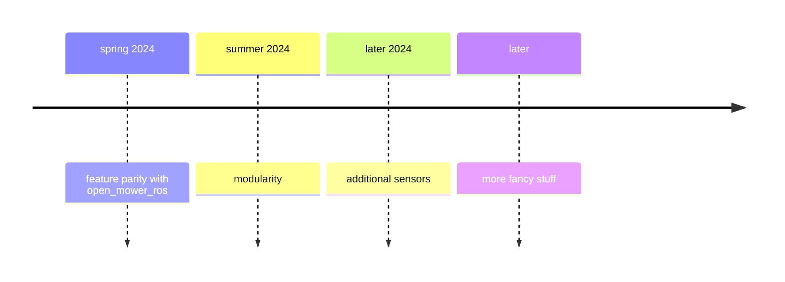

# {{ $frontmatter.title }}

## Introduction

As mentioned in [Getting started](getting-started.md), the project is mostly for my own learning purposes. I am not sure how far I will get with it, but I will try to keep it up to date.

I want to share it with others, so also I want to make it clear what is the current state of the project and what is planned for the future. (what I can afford myself to plan given it's a hobby project)

## Roadmap

### Feature parity with open_mower_ros

I'd like to focus first on making sure everyone who is OpenMower user can use OpenMowerNext as a drop-in replacement for open_mower_ros.

This definitely means implementing all the features that are already implemented in open_mower_ros, but done in a different way.

Compatibility with all side projects that are using open_mower_ros is not expected. For example, Mowgli or OpenMowerGUI are not in the scope of this project.

### Modularity

What if we have a modular system that can be used with other hardware as well?
One of the closest examples would be a Mowgli compatible hardware layer. What about other YardForce or similar mowers?

### Additional sensors

It does not limit to base mower only. What about other sensors?

### More fancy stuff
What about other capabilities? Your robot could be a mower, but also be responsible for other garden chores.

## GitHub issues

All the work is tracked in [GitHub issues](https://github.com/jkaflik/OpenMowerNext/issues):

- Feature parity issues can be [filter out with feature-parity label](https://github.com/jkaflik/OpenMowerNext/issues?q=is%3Aopen+is%3Aissue+label%3Afeature-parity). Not all gaps are identified yet.
- Future improvements are tracked with [future-ideas label](https://github.com/jkaflik/OpenMowerNext/issues?q=is%3Aopen+is%3Aissue+label%3Afuture-ideas).

Feel free to add your own.

## Conclusion

All this stuff is not going to happen overnight. It will take time. It can stay as a hobby project, or it can grow into something bigger. [It's up to you](contributing).