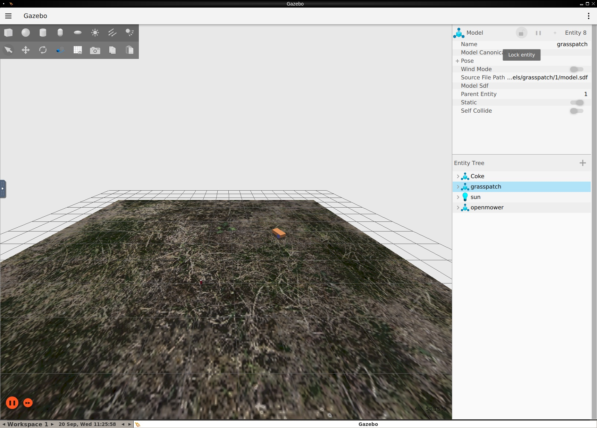

# Simulator

## Overview

OpenMowerNext incorporates a [Gazebo](http://gazebosim.org/) simulator and [ros_gz](https://github.com/gazebosim/ros_gz) integration.

::: tip
If you are not familiar with Gazebo, please refer to [Gazebo tutorials](http://gazebosim.org/tutorials).
:::

::: warning
This project uses Gazebo Fortress. Formerly known as Ignition Fortress.
:::



## Getting started

Run the following command to start the simulator:

```bash
ros2 launch openmower sim.launch.py
```


If run inside [devcontainer](devcontainer), Gazebo GUI will be displayed in a VNC web client. You can access it by opening [`http://localhost:12345`](http://localhost:12345) in your browser.

::: tip
Learn more about [VNC client](devcontainer#detailed).
:::

It's possible to run the simulator with GUI on external host machine. I haven't done it myself since GUI is unstable on MacOS.

## Current state

- :white_check_mark: Robot model
- :white_check_mark: ros2_control controller
- :white_check_mark: GPS sensor
- :white_check_mark: IMU sensor
- :white_check_mark: can of Coke
- :construction: [Emulate OpenMowerNext firmware](https://github.com/jkaflik/OpenMowerNext/issues/8)

## World definition

<<< ../worlds/empty.sdf{xml}

